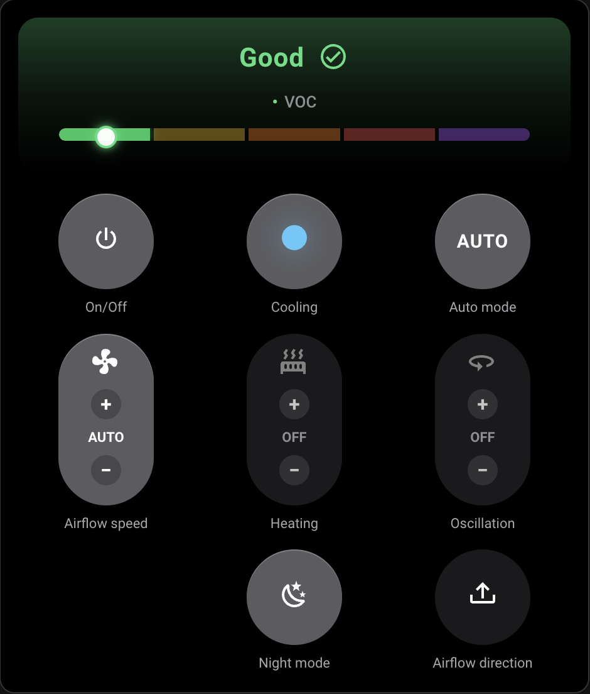

# Dyson Remote (HACS)

**Lovelace** card for **Home Assistant** with the same control-strip layout as the **Dyson iOS** app.

## Preview



## Features

- Optional **air quality** strip: status (Good → Severe), pollutant line, five-color bar with thumb, and a soft accent tint—each piece can be toggled in the visual editor.
- **Top row:** Power, Cooling, Auto
- **Middle row:** Airflow `+/-`, Heating or Humidity `+/-` (auto-detected), Oscillation
- **Bottom row:** Night mode

It targets **Dyson `fan.*` entities** (including purifiers and humidifiers that expose a fan). Where possible it uses built-in Home Assistant services.

## Prerequisites

This card is **UI only**—it does not connect to Dyson devices by itself. You need a Dyson integration in Home Assistant that creates the underlying entities.

**Recommended:** **[hass-dyson](https://github.com/cmgrayb/hass-dyson)** — unofficial Dyson integration (install via HACS as category **Integration**). This card is developed and tested against the `fan`, `climate`, `select`, and air-quality **`sensor`** entities and attributes **hass-dyson** exposes.

Other Dyson integrations may still work if they offer compatible entities and standard services; see **Troubleshooting** if actions or sensors do not line up.

## Install (HACS)

1. Open **HACS** -> **Dashboard** (or **Frontend** in older versions).
2. Open menu (three dots) -> **Custom repositories**.
3. Add this repository URL, category **Dashboard**.
4. Search for **Dyson Remote** in HACS and install it.
5. Reload Lovelace (or restart Home Assistant) when prompted.

After install, HACS adds the card as a dashboard resource for you in most setups.

### If the resource is not auto-added

```yaml
lovelace:
  mode: yaml
  resources:
    - url: /hacsfiles/hacs-dyson-remote/hacs-dyson-remote.js
      type: module
```

## Quick Start

```yaml
type: custom:dyson-remote-card
entity: fan.your_dyson_entity
```

Optional settings:

```yaml
type: custom:dyson-remote-card
entity: fan.your_dyson_entity
title: Living Room
show_temperature_header: false
show_air_quality_header: true
# Subsections default on. Use hide_* when a section should stay off — Lovelace often drops plain `false` booleans from YAML.
# hide_air_quality_category: true
# hide_air_quality_pollutant: true
# hide_air_quality_bar: true
mushroom_shell: true
oscillation_presets: [0, 45, 90, 180, 350]
# Optional: only if auto-discovery cannot find your oscillation select (rare)
oscillation_select_entity: select.dyson_zz7_ca_mja1790a_oscillation
```

`title` is optional. If omitted or blank, the title row is hidden (no fallback title is shown).

For **hass-dyson**, the card usually auto-links air quality sensors, oscillation `select`, and combo humidifier/climate entities. If something does not match your setup, see **[docs/integration-behavior.md](docs/integration-behavior.md)** (contributor-oriented detail) or **Troubleshooting** below.

### Dashboard sizing (Sections view)

In Home Assistant Sections view, you can adjust the card size (columns/rows) directly from the visual editor.
This card now includes a visual config editor, so Home Assistant should no longer show "Visual editor not supported" when editing it.

## What the controls do

**Column alignment (three-column layout):** Top row is **On/Off** | **Cooling / Auto purify** | **Auto mode / Auto humidify**. The stepper row is **Oscillation** | **Heating** or **Humidity control** | **Airflow** on ordinary fans; on **humidifier combo** cards it is **Oscillation** | **Airflow** | **Humidity control** so airflow sits under Auto purify and humidity under Auto humidify. The bottom row uses an **invisible spacer** cell (column 1) plus **Night mode** and **Airflow direction** so plain grid auto-flow keeps Night in the **center column** without relying on `grid-column` (which some narrow `@container` branches were resetting). The spacer is `display: none` in the two-column narrow layout. On viewports about **346px** wide and up (the card’s own width), row **2** is fixed for the three steppers so columns cannot drift onto extra rows.

| Control | Behavior |
|--------|----------|
| Air quality header (optional) | When enabled, can show category row, pollutant line, and/or color bar (each toggled in the editor) using linked `sensor.*` / fan attributes |
| On/Off | Turns device on or off |
| Cooling | Forces cooling/fan-only behavior where supported (integration-dependent) |
| Auto mode | Toggles Auto/Manual when those presets exist |
| Airflow `+/-` | Shows app-style speed levels (**OFF, 1..10**) and maps them to fan percentage internally |
| Heating/Humidity `+/-` | One thermal stepper: target temperature for normal fans, or target humidity when combo mode is detected (linked **`humidifier.*`**, **`humidify`** in climate **`hvac_modes`**, or **`humidifier.*`** entity). Humidity uses the **lowest** `min_humidity` and **tightest** `max_humidity` across fan/climate/humidifier (so a climate floor of 50 does not block 30–40% when the humidifier allows it), honors **`target_humidity_step`** / **`humidity_step`** when present (e.g. 10%), **−** from **AUTO** exits auto to a manual %, and **−** at the minimum % turns humidify **Off** (`humidifier.set_mode` / `turn_off` or climate away from **humidify**). |
| Oscillation `+/-` | Cycles configured angles; prefers `select.*_oscillation` when present, else `dyson.set_angle` / `fan.oscillate` |
| Night mode | Toggles night mode when supported |

Note: Dyson integrations differ. If your setup uses different services or entity types, use scripts/automations as adapters.

## Mushroom-style look

By default, the card uses a Mushroom-style outer shell via Home Assistant theme variables.  
Set `mushroom_shell: false` for a full-bleed black panel.

## Troubleshooting

- README in HACS looks stale: confirm changes are pushed to your default branch, then run HACS "Reload data" and refresh browser.
- Card looks unchanged after an update: hard-refresh the dashboard (or clear the site cache). In the visual editor, the card description includes a **build** date string—if it did not advance, Home Assistant is still loading an older `hacs-dyson-remote.js` from disk or cache.
- Card missing after install: reload Lovelace and verify the resource path.
- Actions do not match your Dyson integration: map behavior with scripts/automations and call those from your dashboard workflow.

## License

MIT
